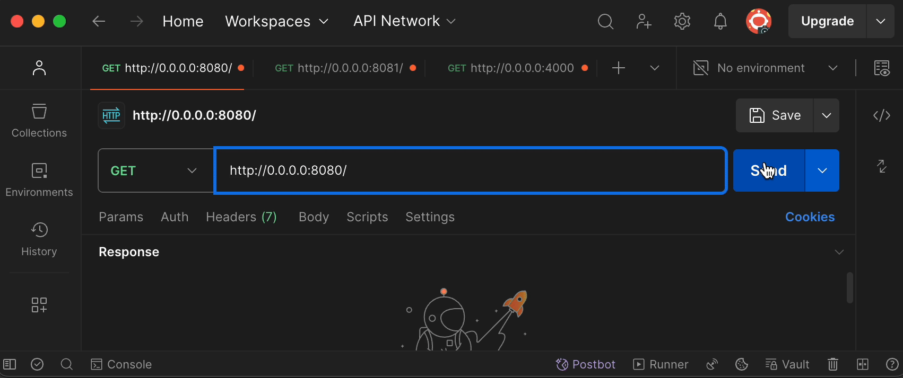
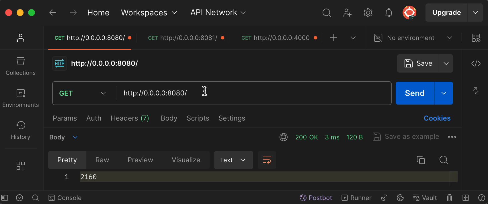

# Sticky sessions (Липкие сессии)

Страницы с прилипающими сессиями, также известные как сессионная аффинность или
сессионная устойчивость, — это техника, используемая при балансировке нагрузки
веб-серверов, чтобы гарантировать, что последующие запросы от определенного
клиента всегда направляются на тот же сервер в кластере или группе серверов.

Когда пользователь посещает веб-сайт, его сессионная информация (такая как
идентификатор сессии или куки) обычно хранится на сервере, чтобы сохранять его
состояние между запросами. С прилипающими сессиями, после того как запрос
пользователя в начале направлен на определенный сервер, все последующие запросы
от этого пользователя в том же сеансе также отправляются на тот же сервер.

Это особенно полезно для приложений, которые хранят данные сеанса локально на
отдельных серверах, а не используют общее хранилище сеансов. Без прилипающих
сессий последующие запросы от того же пользователя могут быть направлены на
разные серверы, что может вызвать проблемы с согласованностью сеанса и,
возможно, привести к ошибкам или неожиданному поведению.

Прилипающие сессии могут быть реализованы с использованием различных методов,
таких как аффинность на основе IP-адресов, аффинность на основе куки или
перезапись URL, в зависимости от балансировщика нагрузки и конкретных
требований приложения.

### Без липких сессий

### С липкими сессиями

