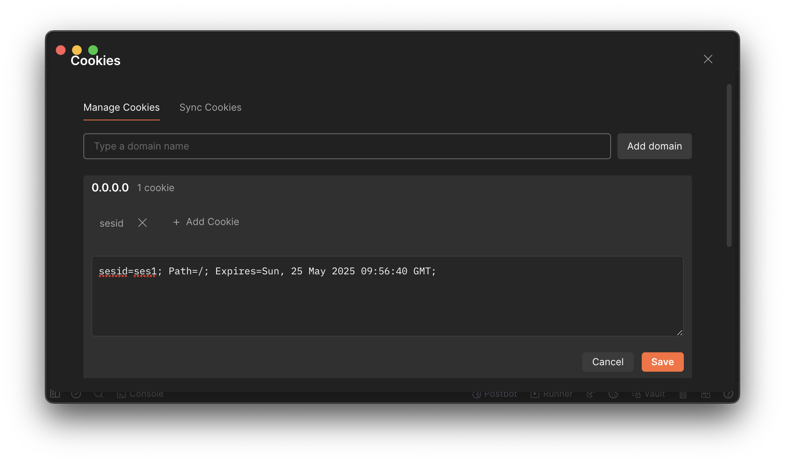

# nginx sticky sessions

Запуск nginx в контейнере и двух инстансов сервера.

```sh
docker-compose up --build --scale server=2
```

В запросе должна быть cookie с ключом `sesid`, по ней и определяется сервер к
которому нужно делать запрос. В реальном приложении сам сервер может
устанавливать такие cookie.

> Чтобы отключить липкие сессии нужно удалить строку
>
> ```
> hash $cookie_sesid;
> ```


